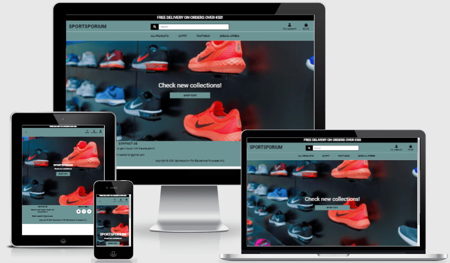

# [Sportsporium](https://rs87801-sportsporium.herokuapp.com/)

Sportsporium is an online sports emporium to buy men's footwear, clothing and sportswear.  This website has been created for my fourth milestone project as part of the Diploma in Full Stack Software Development course with Code Institute. The website is responsive on all device sizes.

***

## Table of contents

-  [Demo](#demo)
-  [Overview](#overview)
-  [User Experience (UX)](#user-experience)
    - [Strategy](#strategy)
        - [User Stories](#user-stories)
    - [Scope](#scope)
        - [Functional Requirements](#functional-requirements)
        - [Future Planned Features](#future-planned-features)
    - [Structure](#structure)
        - [Flowchart](#flowchart)
    - [Skeleton](#skeleton)
        - [Wireframe mock ups](#wireframe-mock-ups)
    - [Surface](#surface)
        - [Color Scheme](#color-scheme)
        - [Typography](#typography)
        - [Images](#images)
-  [Technologies used](#technologies-used)
    - [Tools](#tools)
    - [Front-End Technologies](#front-end-technologies)
    - [Back-End Technologies](#back-end-technologies)
-  [Resources](#resources)
-  [Testing](#testing)
-  [Code validity](#code-validity)
-  [Version Control](#version-control)
-  [Deployment](#deployment)
    - [Local Deployment](#local-deployment)
    - [Remote Deployment](#remote-deployment)
-  [Credits](#credits)
    - [Media](#media)
    - [Content](#content)
    - [Code Snippets](#code-snippets)
-  [Acknowledgments](#acknowledgements)

***

## Demo
Please click on the image to open link in a new browser window.  
 

A live demo can be found - [here](https://rs87801-sportsporium.herokuapp.com/)

Project Repository can be found - [here](https://github.com/Ranj247/sportsporium_v1)

***

## Overview
This project is Milestone Project 4 and the final project as part of the Code Institute's FullStack Software Development Diploma Course. Main requirements are to build a full-stack website based around business logic used to control a centrally-owned dataset which contains set up authentication access mechanism and provide paid access to the site's data and purchase of the product.

This project demonstrates the skills and knowledge of using the HTML5, CSS3, JavaScript, Python, Django, AWS, Relational database Postgres and Stripe payments in Back-End development. The aim of this project is to create an e-commerce web application named **Sportsporium** which is an online sports emporium to buy men's footwear, clothing and sportswear. The users can search for and purchase sports shoes, joggers, hoddies etc. and create an account to save delivery information for future use, review their history orders. The owner/administrator of the shop  (with the appropriate access) can add, edit and delete products.

The project is for educational purposes only.
---

***

## User Experience
The sports shoes industry is undergoing a period of huge growth, such as with popular nike shoes selling out instantly from retailers, and being re-sold at after-market values much higher than the original retail value. This site advances the user's goals by allowing users to purchase footwear, clothes and sportswear at affordable prices. 

The User Experience for this site was planned & developed using the [5 Planes of UX Design](https://www.geeksinux.com/the-elements-of-user-experience-design/): Strategy, Scope, Structure, Skeleton, Surface. It is intended to be used as a full-stack application with a clean and user - friendly site design.

### Strategy
#### User Stories

**Viewing and navigation**

| User Story ID | AS a/an                     | I want to be able to ...                            | So that I can ...                                            |
| ------------- | --------------------------- | ----------------------------------------------------| ------------------------------------------------------------ |
| 1.            | new user                    | immediately recognise website purpose               | identify the interest in the website content                 |
| 2.            | new user                    | navigate the site easily                            | search for products effectively                              |
| 3.            | new user                    | view the website on mobile and other large devices  | use it on a desktop or on the go                             |
| 4.            | general visitor             | get in touch website owner                          | enquire about the products, and store policies               |
| 5.            | new user & future shopper   | see product lists                                   | find which product I'd like to purchase                      |
| 6.            | new user & future shopper   | check particular product's detail                   | check product's price, description, rating, image and sizes before buying |
| 7.            | new user and future shopper | identify sales, and special offers                  | take advantage of special savings on products to purchase    |
| 8.            | new user and future shopper | view the total of my purchases                      | keep an eye on the purchase budget                           |

**Registration and User Accounts**       

| User Story ID | AS a/an                     | I want to be able to ...                        | So that I can ...                                                     |
| --------------| --------------------------- | ----------------------------------------------- | ------------------------------------------------------------          |
| 9.            | new user and future shopper | register for an account                         | have a personal account and see my profile                            |
| 10.           | registered user             | login/out                                       | access my personal account information                                |
| 11.           | registered user             | reset the password in case I don't recall       | recover  access to my account                                         |
| 12.           | registered user             | receive an email confirmation upon registration | verify account registration                                           |
| 13.           | registered user             | have a customized dashboard                     | view order history, order confirmation, and save default information  |

**Sorting and searching**      

| User Story ID | AS a/an     | I want to be able to ...                                    | So that I can ...                                                         |
| --------------| ----------- | ----------------------------------------------------------- | ------------------------------------------------------------              |
| 14.           | Shopper     | sort the list of available products                         | easily identify the best rated, best priced and categorically sorted products |
| 15.           | Shopper     | sort a specific category of product                         | find the best-priced or best-rated product in a specific category or sort the products in that category by name       |
| 16.           | Shopper     | sort multiple categories of products simultaneously         | find the best-priced or best-rated products across broad categories, such as "outfit" or "footwear"       |
| 17.           | Shopper     | search for a product by name or description                 | find a specific product I'd like to purchase                              |
| 18.           | Shopper     | easily see what I've searched for and the number of results | quickly decide whether the product I want is available                    |

**Purchasing the checkout**

| User Story ID     | AS a/an     | I want to be able to ...                                            | So that I can ...                                            |
| ----------------- | ----------- | ------------------------------------------------------------        | ------------------------------------------------------------ |
| 19.               | shopper     | easily select the size and quantity of a product when purchasing it | ensure I don't accidentally select the wrong product, quantity or size |
| 20.               | shopper     | view items in my bag to be purchased                                | decide if I want to purchase an item or edit it              |
| 21.               | shopper     | adjust the quantity of individual items in my bag                   | easily make changes to my purchase before checkout           |
| 22.               | shopper     | easily enter my payment information                                 | checkout quicky and with bo hassles                          |
| 23.               | shopper     | feel my personal and payment information is safe and secure         | confidently provide the needed information to make a purchase|
| 24.               | shopper     | view an order confirmation after checkout                           | verify that I haven't made any mistakes                      |
| 25.               | shopper     | receive an email confirmation after checking out                    | keep the confirmation of what I've purchased for my records  |

**Navigation**  

| User Story ID     | AS a/an     | I want to be able to ...                                | So that I can ...                  |
| ----------------- | ----------- | ----------------------------------------------------    | ---------------------------------- |
| 26.               | site owner  | access product management from the homepage             | access my account                  |
| 27.               | site owner  | access my dashboard from the homepage                   | return to my dashboard at any time |
| 28.               | site owner  | receive a notification when there is a pending order    | know when I am making money        |

**Product management**

| User Story ID     | AS a/an     | I want to be able to ...                            | So that I can ...                                                       |
| ----------------- | ----------- | ----------------------------------------------------| ------------------------------------------------------------            |
| 29.               | site owner  | add new products                                    | add new items to my online store                                        |
| 30.               | site owner  | edit/update products                                | update products prices, descriptions, images and other product criteria |
| 31.               | site owner  | delete products                                     | remove erroneous products or products that are no longer available      |

 **Authentication & account**    

| User Story ID     | AS a/an     | I want to be able to ...               | So that I can ...                          |
| ----------------- | ----------- | -------------------------------------- | ------------------------------------------ |
| 32.               | site owner  | verify my email address                | set up my account securely                 |
| 33.               | site owner  | update my account information          | maintain access to my account              |
| 34.               | site owner  | logout when I am finished with my work | logout of my account                       |
| 35.               | site owner  | reset my password                      | recover my account or upgrade its security |

### Scope
#### Functional Requirements
- Mobile-first website that is responsive on all devices.
- Informative Landing Page.
- The navbar has been fixed, and is accessed by clicking on the 'hamburger' icon in the top left hand corner of the screen on small and medium devices. When the 'hamburger' icon is clicked, the 'Home', 'All Products', 'Outfit', 'Footwear', and 'Special Offers' links are displayed.
- The Search box has been replaced by an icon on small devices, which displays a search box when clicked.
- Search by a keyword function that users can search for product by keyword.

#### Future Planned Features

### Structure
#### Flowchart
- Flowchart created using [Lucidchart](https://www.lucidchart.com):  
    

### Skeleton
#### Wireframe mock ups
- Wireframes created using [Balsamiq](https://balsamiq.com/):  
    

### Surface
#### Color Scheme
- Chosen using [Image Color Picker](https://imagecolorpicker.com/en):  
      
- Primary color: #6c9494 (Heather Color) - This color applies to the header & footer section which maintains contrast to the landing page, and hero image.
- Background color: #555555 (Emperor Color) - This color applies to the background.

#### Typography
- Bootstrap CSS default fonts applied.
- For the content, I have chosen the font [Roboto](https://fonts.google.com/specimen/Roboto?preview.text=All%20products%20Shoes%20&preview.text_type=custom&query=roboto) with a fallback of **sans-serif**. 'Roboto' is the one of the recommended fonts used on e-commerce sites.

#### Images
- All Product pictures of Outfit, and Footwear are taken from the [Life Style Sports](https://www.lifestylesports.com/ie/), and [Nike](https://www.nike.com/ie/). This project is for educational purposes only so the accociated credit has been included in the [Media Credits](#media). 
- [Shutterstock](https://www.shutterstock.com/) was used to select the site's images, full image credits can be found in the [Media Credits](#media).
- The default image if image of the product is not available  

***

## Technologies Used
### Tools
- [GitPod](https://www.gitpod.io/)
    - Used as the preferred IDE for development.
- [Git](https://git-scm.com/)
    - Used via the Gitpod terminal for version control, with regular commits, and to push to GitHub & Heroku.
- [GitHub](https://github.com/)
    - Used to store the site's code repository.
- [Heroku](https://www.heroku.com/)
    - Used to host the deployed site.
- [Lucidchart](https://www.lucidchart.com)
    - To create the site's structural flowchart.
- [Balsamiq](https://balsamiq.com/)
    - To create the site's wireframes.
- [Google Fonts](https://fonts.google.com/)
    - Used to import the site's fonts.
- [Compress JPEG](https://compressjpeg.com/)
    - Used to compress the site's hero image.
- [Cloudinary](https://cloudinary.com/)
    - Used to link image files to the README.md file.
- [favicon.io](https://favicon.io/)
    - Used to generate the site's favicon image.

### Front-End Technologies
- [HTML5](https://developer.mozilla.org/en-US/docs/Glossary/HTML5)
- [CSS3](https://developer.mozilla.org/en-US/docs/Web/CSS)
- [JavaScript](https://developer.mozilla.org/en-US/docs/Web/JavaScript)
- [JQuery 3.6.0](https://jquery.com/)
    - Used as the primary JavaScript library.
- [Bootstrap 4.5](https://getbootstrap.com/docs/4.5/getting-started/introduction/)
    - Used as a responsive front-end framework.

### Back-End Technologies
- [Python](https://www.python.org/)
- [Django](https://www.djangoproject.com/)
    - Used with Python as the full-stack web framework.
- [Django Allauth](https://django-allauth.readthedocs.io/en/latest/)
    - Used to create the site's authentication functionality.
- [PostgreSQL](https://www.postgresql.org/)
    - Used with Heroku to store the live site's relational database.

### Other
- [Stripe Payments](https://stripe.com/en-ie/payments)
    - Used Stripe Elements via JavaScript for the Checkout's front-end card element, and to create payments from the back-end via Python.
- [Amazon AWS S3](https://aws.amazon.com/s3/)
    - Used to store the live project's static and media files

***

## Resources

- [Code Institute Course Content](https://courses.codeinstitute.net/login) -Main source of fundamental knowledge.
- [Stack Overflow](https://stackoverflow.com/) -General resource.
- [Google chrome developer tools](https://developer.chrome.com/docs/devtools/) - used to check page elements, help debug issues with the site layout and test different CSS styles and console JS.
- [w3schools](https://www.w3schools.com/default.asp)-General resource.
- [Balsamic](https://balsamiq.com/wireframes/) - Wireframing design tool to create wireframes.
- [Am I Responsive](http://ami.responsivedesign.is/) - Responsive website mockup image generator.
- [Imagecolorpicker](https://imagecolorpicker.com/en) - color schemes generator.
- [a11y](https://color.a11y.com/Contrast/) - Website color contrast checker
- [Lighthouse Report Viewer](https://googlechrome.github.io/lighthouse/viewer/) - used as part of testing website on grounds of Performance, Accessibility, Best Practices and SEO.

***

## Testing
Testing documentation can be found in the separate [TESTING.md](TESTING.md) file.

***

## Code validity
- HTML - [Markup Validation W3C Service](https://validator.w3.org/)
- CSS - [Jigsaw  Validation W3C Service](https://jigsaw.w3.org/css-validator/)

***

## Version Control
- Used Git for version control.

***

## Deployment
### Local Deployment

Follow the below steps for local deployment:

### Remote Deployment

***

## Credits
### Media
- [favicon.io](https://favicon.io/) was used to generate the site's favicon image.
- [Pexels](https://www.pexels.com/) used to source Hero image and customised to be used for the website.
- [Am I Responsive](http://ami.responsivedesign.is/) - was used to create the mock-up image used in the README file.

### Content

### Code Snippets

***

## Acknowledgements
I would like to thank:
- My mentor, **Caleb Mbakwe**, for his guidance, valuable feedbacks, and encouragement throughout the project.
***