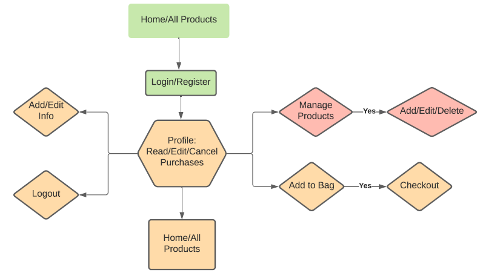
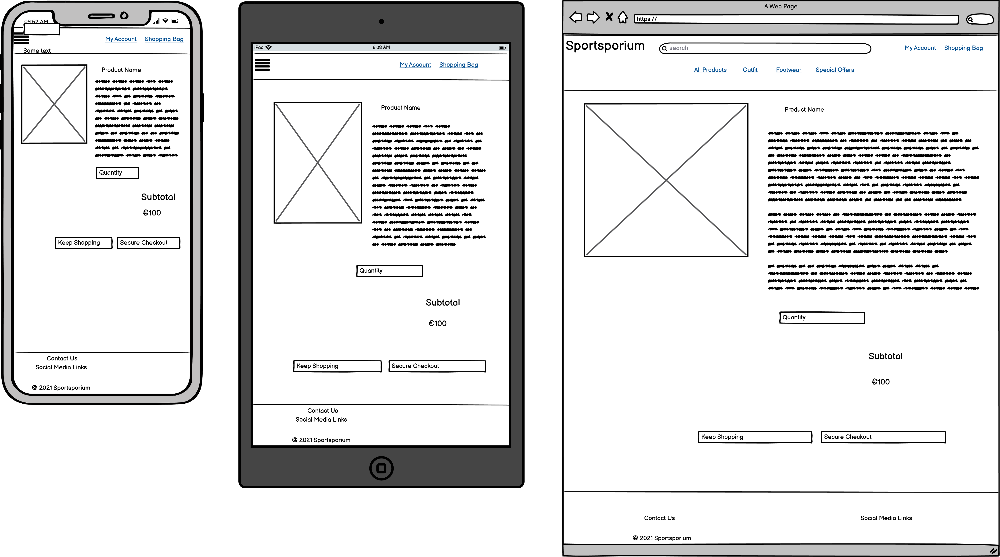

# [Sportsporium](https://rs87801-sportsporium.herokuapp.com/)

Sportsporium is an online sports emporium to buy men's footwear, clothing and sportswear.  This website has been created for my fourth milestone project as part of the Diploma in Full Stack Software Development course with Code Institute. The website is responsive on all device sizes.

***

## Table of contents

-  [Demo](#demo)
-  [Overview](#overview)
-  [User Experience (UX)](#user-experience)
    - [Strategy](#strategy)
        - [User Stories](#user-stories)
    - [Scope](#scope)
        - [Existing Features](#existing-features)
        - [Future Planned Features](#future-planned-features)
    - [Structure](#structure)
        - [Flowchart](#flowchart)
    - [Skeleton](#skeleton)
        - [Wireframe mock ups](#wireframe-mock-ups)
    - [Surface](#surface)
        - [Color Scheme](#color-scheme)
        - [Typography](#typography)
        - [Images](#images)
-  [Technologies used](#technologies-used)
    - [Tools](#tools)
    - [Front-End Technologies](#front-end-technologies)
    - [Back-End Technologies](#back-end-technologies)
-  [Resources](#resources)
-  [Testing](#testing)
-  [Code validity](#code-validity)
-  [Version Control](#version-control)
-  [Deployment](#deployment)
    - [Local Deployment](#local-deployment)
    - [Remote Deployment](#remote-deployment)
-  [Credits](#credits)
    - [Media](#media)
    - [Content](#content)
    - [Code Snippets](#code-snippets)
-  [Acknowledgments](#acknowledgements)

***


## Demo
Please click on the image to open link in a new browser window.<br><br>


A live demo can be found - [here](https://rs87801-sportsporium.herokuapp.com/)

Project Repository can be found - [here](https://github.com/Ranj247/sportsporium_v1)

***

## Overview
This project is Milestone Project 4 and the final project as part of the Code Institute's FullStack Software Development Diploma Course. Main requirements are to build a full-stack website based around business logic used to control a centrally-owned dataset which contains set up authentication access mechanism and provide paid access to the site's data and purchase of the product.

This project demonstrates the skills and knowledge of using the HTML5, CSS3, JavaScript, Python, Django, AWS, Relational database Postgres and Stripe payments in Back-End development. The aim of this project is to create an e-commerce web application named **Sportsporium** which is an online sports emporium to buy men's footwear, clothing and sportswear. The users can search for and purchase sports shoes, joggers, hoodies etc. and create an account to save delivery information for future use, review their history orders. The owner/administrator of the shop  (with the appropriate access) can add, edit and delete products.

The project is for educational purposes only.
---

***

## User Experience
This site advances the user's goals by allowing users to purchase footwear, clothes and sportswear at affordable prices. 

The User Experience for this site was planned & developed using the [5 Planes of UX Design](https://www.geeksinux.com/the-elements-of-user-experience-design/): Strategy, Scope, Structure, Skeleton, Surface. It is intended to be used as a full-stack application with a clean and user - friendly site design.

### Strategy
#### User Stories

**Viewing and navigation**

| User Story ID | AS a/an                     | I want to be able to ...                            | So that I can ...                                            |
| ------------- | --------------------------- | ----------------------------------------------------| ------------------------------------------------------------ |
| 1.            | new user                    | immediately recognise website purpose               | identify the interest in the website content                 |
| 2.            | new user                    | navigate the site easily                            | search for products effectively                              |
| 3.            | new user                    | view the website on mobile and other large devices  | use it on a desktop or on the go                             |
| 4.            | general visitor             | get in touch website owner                          | enquire about the products, and store policies               |
| 5.            | new user & future shopper   | see product lists                                   | find which product I'd like to purchase                      |
| 6.            | new user & future shopper   | check particular product's detail                   | check product's price, description, rating, image and sizes before buying |
| 7.            | new user and future shopper | identify sales, and special offers                  | take advantage of special savings on products to purchase    |
| 8.            | new user and future shopper | view the total of my purchases                      | keep an eye on the purchase budget                           |


**Registration and User Accounts**       

| User Story ID | AS a/an                     | I want to be able to ...                        | So that I can ...                                                     |
| --------------| --------------------------- | ----------------------------------------------- | ------------------------------------------------------------          |
| 9.            | new user and future shopper | register for an account                         | have a personal account and see my profile                            |
| 10.           | registered user             | login/out                                       | access my personal account information                                |
| 11.           | registered user             | reset the password in case I don't recall       | recover  access to my account                                         |
| 12.           | registered user             | receive an email confirmation upon registration | verify account registration                                           |
| 13.           | registered user             | have a customized dashboard                     | view order history, order confirmation, and save default information  |

**Sorting and searching**      

| User Story ID | AS a/an     | I want to be able to ...                                    | So that I can ...                                                         |
| --------------| ----------- | ----------------------------------------------------------- | ------------------------------------------------------------              |
| 14.           | Shopper     | sort the list of available products                         | easily identify the best rated, best priced and categorically sorted products |
| 15.           | Shopper     | sort a specific category of product                         | find the best-priced or best-rated product in a specific category or sort the products in that category by name       |
| 16.           | Shopper     | sort multiple categories of products simultaneously         | find the best-priced or best-rated products across broad categories, such as "outfit" or "footwear"       |
| 17.           | Shopper     | search for a product by name or description                 | find a specific product I'd like to purchase                              |
| 18.           | Shopper     | easily see what I've searched for and the number of results | quickly decide whether the product I want is available                    |


**Purchasing the checkout**

| User Story ID     | AS a/an     | I want to be able to ...                                            | So that I can ...                                            |
| ----------------- | ----------- | ------------------------------------------------------------        | ------------------------------------------------------------ |
| 19.               | shopper     | easily select the size and quantity of a product when purchasing it | ensure I don't accidentally select the wrong product, quantity or size |
| 20.               | shopper     | view items in my bag to be purchased                                | decide if I want to purchase an item or edit it              |
| 21.               | shopper     | adjust the quantity of individual items in my bag                   | easily make changes to my purchase before checkout           |
| 22.               | shopper     | easily enter my payment information                                 | checkout quickly and without hassles                          |
| 23.               | shopper     | feel my personal and payment information is safe and secure         | confidently provide the needed information to make a purchase|
| 24.               | shopper     | view an order confirmation after checkout                           | verify that I haven't made any mistakes                      |
| 25.               | shopper     | receive an email confirmation after checking out                    | keep the confirmation of what I've purchased for my records  |

**Navigation**  

| User Story ID     | AS a/an     | I want to be able to ...                                | So that I can ...                  |
| ----------------- | ----------- | ----------------------------------------------------    | ---------------------------------- |
| 26.               | site owner  | access product management from the homepage             | access my account                  |
| 27.               | site owner  | access my dashboard from the homepage                   | return to my dashboard at any time |
| 28.               | site owner  | receive a notification when there is a pending order    | know when I am making money        |

**Product management**

| User Story ID     | AS a/an     | I want to be able to ...                            | So that I can ...                                                       |
| ----------------- | ----------- | ----------------------------------------------------| ------------------------------------------------------------            |
| 29.               | site owner  | add new products                                    | add new items to my online store                                        |
| 30.               | site owner  | edit/update products                                | update products prices, descriptions, images and other product criteria |
| 31.               | site owner  | delete products                                     | remove erroneous products or products that are no longer available      |


 **Authentication & account**    

| User Story ID     | AS a/an     | I want to be able to ...               | So that I can ...                          |
| ----------------- | ----------- | -------------------------------------- | ------------------------------------------ |
| 32.               | site owner  | verify my email address                | set up my account securely                 |
| 33.               | site owner  | update my account information          | maintain access to my account              |
| 34.               | site owner  | logout when I am finished with my work | logout of my account                       |
| 35.               | site owner  | reset my password                      | recover my account or upgrade its security |

### Scope
#### Existing Features
- The site contains 5 separate custom apps. Each app has its own set of features.
    - Home
    - Products
    - Bag
    - Checkout
    - Profile
  
- There are 4 types of toast messages, they appear on the right side of the site when particular actions are performed by the user and provide feedback on the action taken. See the list below:
    - Success
    - Info
    - Warning
    - Error

### Responsiveness
 - All templates of this project have been built with the responsive framework Bootstrap 4.6 and also used targeted media queries to make this project responsive on all screen sizes.

## NAVIGATION BAR
This project has two navigation bars present on large screens and folded into the drop-down list on small devices:
1. Main navigation bar:
- Logo  `Sportsporium` navigates user to home page.
- `Search bar` allows any user using keywords to search for products by name, word, category.
- `My account` dropdown menu: Links to register or sign in forms when the user is logged out. User is able to log in as a registered user and is able to access the menu links: the user's profile and the logout page. When logged in as an admin, the user has access to the dropdown links: the product management, profile app and the log out page.
- `Shopping bag` navigate the user to the shopping bag. When the bag is empty it displays your bag is empty. When items are added to the shopping bag it is updated and displays the total price.
2. Navigation bar: Home/All Products/Outfit/Footwear/SpecialOffers:
- This navigation bar allows the user to check the shop collections by two different categories as  Outfit and Footwear.
- `All Products` dropdown menu sort all products by Price, Rating, Categories and  All products.
- `Special offer` dropdown menu filter products by New Arrivals, Sale and Displays All Specials.
3. On top of navigation bar there is `Free Delivery banner` which informs users of the free delivery threshold and is counted when the user proceeds to the secure checkout.
- On mobile and medium devices navigation bar is hidden behind the hamburger sign and the `Search` icon, `My Account`, `Shopping bag` visible on the main navbar. The user can navigate to the home page through the hamburger menu. 

## HOME PAGE

- The home page presents a hero image which is the inside view of a Nike showroom where the shoes are displayed which hints the user that the website sells sports footwear. 

## FOOTER
- The footer contains contact us details for the site owner if a user has any queries. 
- The footer contains Social media links: Tweeter, Instagram and Facebook. 

## SHOPPING BAG
- Shopping Bag App allows the user to add/adjust/delete products to the shopping bag, view the Grand total price and details in the bag.
- When a product is added, a preview of the shopping bag is displayed in a toast and the Grand total price/shipping price is updated.
- There is free delivery counter that calculates how much users need to spend to get the free delivery.

## CHECKOUT
- Checkout App allows the user to safely purchase the selection of items placed in the bag using the Stripe system.
- Any user is able to purchase the products without being registered and logged into their account. If the payment was successful the user will receive the confirmation email with the order details, confirmation page and the success toast message will display on the screen. If logged in the shipping details will be filled from the details given in the user profile.
- The credit card details section is linked to the payment platform Stripe for a secure payment procedure.
- When the `Complete Order` button is clicked it triggers a loading spinner that will remain while Stripe checks the credit card details.
- If the payment did not go through, the user is redirected to the checkout form and informed of the failed procedure.

## PRODUCTS
- Product App allows the user to see products with basic product information: image, name, price, category, average rating.
- Clicking the image takes the user to the specific product detail page.
- Only the super-user (Admin) can have access to the EDIT/DELETE product pills and is able to edit or delete products that already exist in the database.
- Any user can browse products using a `Sort by...` box which sort actual display for eg. Heels by Price, Rating, Name and Category.
- There is a back to top button at the bottom right of the screen, which brings the user back to top of the page. 

## PRODUCT DETAIL PAGE
- Product detail page displays the product details (image, name, price, category, average rating, description, sizes). 
- The quantity button is to choose an amount of products user wants to purchase.
- Only the super-user (Admin) can have access to the EDIT/DELETE product pills and edit or delete products that already exist in the database.


## PRODUCT MANAGEMENT
- Product management is for a super-user/admin and is visible on `My Account` dropdown menu when admin is logged into their account.
- Only a super-user (Admin) has the possibility to add products to the database by filling in the add product form. Images can be selected directly from the admin's computer. There is an option for url links as well.
- Only Admin can edit/delete products in the database on the product site or on the product detail page by using Delete|Edit product pills which redirect the admin to products form to be edited. The alert toast displays the information about editing the product and success toast for edits. 
- Upon deleting the product by admin a modal alert will appears on right corner of the screen.

## REGISTER
- Provides functionality for users to create an account on the site, in order to buy products. User input is validated, and upon successful registration, a User object is created in the database.

## LOGIN/LOGOUT
- Provided users who have registered an account to access their profile, and additional features only available to authenticated users.

## PROFILE
- Allows authenticated users to see their booking history, if applicable, and provides functionality to update/add their default delivery information via a form. Successful submission of this form creates a UserProfile object in the database. In the booking history, the user can click on the booking numbers to see full details of the purchase.


**Features Left to Implement when skills develop**
I would like to add the followung features
- The possibility to get discount on registration
- The possibility to add several photos to a single product.
- The possibility to login via social media.
- The possibility for users to be able to specify different billing and delivery addresses, and methods.
- Automated testing for application
---

### Structure
#### Flowchart
- Flowchart created using [Lucidchart](https://www.lucidchart.com):<br><br>
    <br><br>

### Skeleton
#### Wireframe mock ups
- Wireframes created using [Balsamiq](https://balsamiq.com/):<br><br>
    <br>
    <br>
    <br>
    <br>
    <br>
    <br>
    <br>
    <br>
    <br>
    

### Surface
#### Color Scheme
- Chosen using [Image Color Picker](https://imagecolorpicker.com/en):<br><br>
    <br><br>
- Primary color: #6c9494 (Heather Color) - This color applies to the header & footer section which maintains contrast to the landing page, and hero image.
- Background color: #555555 (Emperor Color) - This color applies to the background.

#### Typography
- Bootstrap CSS default fonts applied.
- For the content, I have chosen the font [Roboto](https://fonts.google.com/specimen/Roboto?preview.text=All%20products%20Shoes%20&preview.text_type=custom&query=roboto) with a fallback of **sans-serif**. 'Roboto' is the one of the recommended fonts used on e-commerce sites.

#### Images
- All Product pictures of Outfit, and Footwear are taken from the [Life Style Sports](https://www.lifestylesports.com/ie/), and [Nike](https://www.nike.com/ie/). This project is for educational purposes only so the accociated credit has been included in the [Media Credits](#media).
- The Hero image was taken from [Shutterstock](https://www.shutterstock.com/), full image credits can be found in the [Media Credits](#media).
- The default image if image of the product is not available <br>

***

## Technologies Used
### Tools
- [GitPod](https://www.gitpod.io/)
    - Used as the preferred IDE for development.
- [Git](https://git-scm.com/)
    - Used via the Gitpod terminal for version control, with regular commits, and to push to GitHub & Heroku.
- [GitHub](https://github.com/)
    - Used to store the site's code repository.
- [Heroku](https://www.heroku.com/)
    - Used to host the deployed site.
- [Lucidchart](https://www.lucidchart.com)
    - To create the site's structural flowchart.
- [Balsamiq](https://balsamiq.com/)
    - To create the site's wireframes.
- [Google Fonts](https://fonts.google.com/)
    - Used to import the site's fonts.
- [Compress JPEG](https://compressjpeg.com/)
    - Used to compress the site's hero image.
- [Cloudinary](https://cloudinary.com/)
    - Used to link image files to the README.md file.
- [favicon.io](https://favicon.io/)
    - Used to generate the site's favicon image.


### Front-End Technologies
- [HTML5](https://developer.mozilla.org/en-US/docs/Glossary/HTML5)
- [CSS3](https://developer.mozilla.org/en-US/docs/Web/CSS)
- [JavaScript](https://developer.mozilla.org/en-US/docs/Web/JavaScript)
- [JQuery 3.6.0](https://jquery.com/)
    - Used as the primary JavaScript library.
- [Bootstrap 4.5](https://getbootstrap.com/docs/4.5/getting-started/introduction/)
    - Used as a responsive front-end framework.

### Back-End Technologies
- [Python](https://www.python.org/)
- [Django](https://www.djangoproject.com/)
    - Used with Python as the full-stack web framework.
- [Django Allauth](https://django-allauth.readthedocs.io/en/latest/)
    - Used to create the site's authentication functionality.
- [PostgreSQL](https://www.postgresql.org/)
    - Used with Heroku to store the live site's relational database.

### Other
- [Stripe Payments](https://stripe.com/en-ie/payments)
    - Used Stripe Elements via JavaScript for the Checkout's front-end card element, and to create payments from the back-end via Python.
- [Amazon AWS S3](https://aws.amazon.com/s3/)
    - Used to store the live project's static and media files

***

## Resources

- [Code Institute Course Content](https://courses.codeinstitute.net/login) -Main source of fundamental knowledge.
- [Stack Overflow](https://stackoverflow.com/) -General resource.
- [Google chrome developer tools](https://developer.chrome.com/docs/devtools/) - used to check page elements, help debug issues with the site layout and test different CSS styles and console JS.
- [w3schools](https://www.w3schools.com/default.asp)-General resource.
- [Balsamic](https://balsamiq.com/wireframes/) - Wireframing design tool to create wireframes.
- [Am I Responsive](http://ami.responsivedesign.is/) - Responsive website mockup image generator.
- [Imagecolorpicker](https://imagecolorpicker.com/en) - color schemes generator.
- [a11y](https://color.a11y.com/Contrast/) - Website color contrast checker
- [Lighthouse Report Viewer](https://googlechrome.github.io/lighthouse/viewer/) - used as part of testing website on grounds of Performance, Accessibility, Best Practices and SEO.

***

## Testing
Testing documentation can be found in the separate [TESTING.md](TESTING.md) file.

***

## Code validity
- HTML - [Markup Validation W3C Service](https://validator.w3.org/)
- CSS - [Jigsaw  Validation W3C Service](https://jigsaw.w3.org/css-validator/)

***

## Version Control
- Used Git for version control.

***

## Deployment
### Local Deployment
The following dependencies will need to be installed in order to run this application locally:
- [Python3](https://www.python.org/downloads) to run the application.
- [PIP](https://pip.pypa.io/en/stable/installing) to install app requirements.
- [GitPod](https://www.gitpod.io/) or any preferred IDE, such as [VSCode](https://code.visualstudio.com/).
- [Git](https://git-scm.com/book/en/v2/Getting-Started-Installing-Git) for cloning and version control.

Follow the below steps for local deployment:

1. Clone the GitHub repository by entering the following command into the Git terminal:
    - `git clone https://github.com/Ranj247/sportsporium_v1.git`
2. After cloning the project, the below environment variables need to be set, either in your IDE's config vars, or in an `env.py` file. Use your own credentials for the values where appropriate.
    - `DEVELOPMENT` - Set to `True`
    - `SECRET_KEY` - The Django secret key. This can be generated from the [Django Secret Key Generator](https://miniwebtool.com/django-secret-key-generator/).
    - `STRIPE_PUBLIC_KEY` - This will need to be copied from the Publishable key on the [Stripe Dashboard API Keys Page](https://dashboard.stripe.com/test/apikeys). A free Stripe test account can be created [here](https://dashboard.stripe.com/register).
    - `STRIPE_SECRET_KEY` - This will need to be copied from the Secret key on the [Stripe Dashboard API Keys Page](https://dashboard.stripe.com/test/apikeys).
3. Create a `.gitignore` file, and add the `env.py` file, if present, to the list of files.
4. Install all requirements from the [requirements.txt](requirements.txt) file using this command:
    - `pip3 -r requirements.txt`
5. Run the app using the following command in the terminal:
    - `python3 manage.py runserver`
6. The Django server should now run locally.
7. After running the Django server for the first time, a new SQLite3 database file should be created automatically.
    - `db.sqlite3`
8. You will then need to make migrations using the below commands to create the database schema.
    - `python3 manage.py makemigrations`
    - `python3 manage.py migrate`
9. To load the Categories and Products data from their respective JSON fixture files, you will need to run the below commands in the order listed, since the Products data relies on the Categories data.
    - `python3 manage.py loaddata categories`
    - `python3 manage.py loaddata products`
10. Next, create a `superuser` in order to access the Django Admin Panel, by running the below command and following the subsequent prompts.
    - `python3 manage.py createsuperuser`
11. Once complete, Django should migrate the `migrations.py` files from each app to configure the below relational data schema.<br>


### Remote Deployment
To deploy this app on Heroku, the following steps were taken:

1. Create a `requirements.txt` file so Heroku can install the required dependencies.
    - `pip3 freeze --local > requirements.txt`
2. Create a `Procfile` containing information about the type of app that will be deployed.
    - `web: gunicorn sportsporium.wsgi:application`
    - Make sure to delete the blank line at the end of the Profile, as this can cause issues when deploying to Heroku later.
3. Create a Heroku account [here](https://signup.heroku.com/), create a project app, and click the "Deploy" tab. 
4. "Connect GitHub" as the Deployment Method, and select "Enable Automatic Deployment".
5. Go to the "Resources" tab in your Heroku app, and in the Add-Ons section, search for the Heroku Postgres add-on.
    - The free "Hobby" level can be selected.
6. In the Heroku "Settings" tab, click the "Reveal Config Vars" button to configure the environment variables as outlined below, with your own credentials where appropriate.
    - `DATABASE_URL` - Set to your Postgres database URL from the previous step.
    - `SECRET_KEY` - The Django secret key. This can be generated from the [Django Secret Key Generator](https://miniwebtool.com/django-secret-key-generator/).
    - `STRIPE_PUBLIC_KEY` - This will need to be copied from the Publishable key on the [Stripe Dashboard API Keys Page](https://dashboard.stripe.com/test/apikeys). A free Stripe test account can be created [here](https://dashboard.stripe.com/register).
    - `STRIPE_SECRET_KEY` - This will need to be copied from the Secret key on the [Stripe Dashboard API Keys Page](https://dashboard.stripe.com/test/apikeys).
    - `EMAIL_HOST_USER` - Your own email address that you wish to use for the site.
    - `EMAIL_HOST_PASS` - A generated App Password from your email provider's settings. For this project, Gmail was used: https://support.google.com/accounts/answer/185833?hl=en 
7. Update the project's `settings.py` file to connect to the remote database using the `dj_database_url` package.
8. You will then need to make migrations again using the below commands to create the database schema.
    - `python3 manage.py makemigrations`
    - `python3 manage.py migrate`
9. Load the Categories and Products data once again from their respective JSON fixture files. You will need to run the below commands in the order listed, since the Products data relies on the Categories data.
    - `python3 manage.py loaddata categories`
    - `python3 manage.py loaddata products`
10. Next, create a new `superuser` in order to access the Django Admin Panel on the deployed site, by running the below command and following the subsequent prompts.
    - `python3 manage.py createsuperuser`
11. Create a free Amazon AWS account [here](https://portal.aws.amazon.com/billing/signup#/start).
    - Amazon AWS S3 will be used to host the site's static and media files.
12. Navigate to the [S3 page](https://s3.console.aws.amazon.com/s3/home?region=eu-west-1) from the AWS Console.
13. Create a new S3 bucket, and follow the next steps to configure the bucket & complete setup.
    - In Permissions > CORS configuration, paste in the below configuration code:
    ```
    [
        {
            "AllowedHeaders": [
                "Authorization"
            ],
            "AllowedMethods": [
                "GET"
            ],
            "AllowedOrigins": [
                "*"
            ],
            "ExposeHeaders": []
        }
    ]
    ```
    - In Permissions > Bucket Policy, click "Edit", then "Policy Generator", and generate a policy. Paste the policy code back into the "Bucket Policy", and save.
14. Navigate to the the [IAM section](https://console.aws.amazon.com/iam/home?region=eu-west-1#/home) of the AWS console, and follow the below steps to configure:
    - Create a new "Group", and attach your S3 Bucket.
    - Create a new "Policy", and attach to the group created in the previous step.
    - Create a new "User" and attach to the same group. Download the new user credentials `.csv` file.
15. In Heroku's Settings tab, add the below variables to your app's config variables, using your own user's credentials as the values:
    - `AWS_ACCESS_KEY_ID`
    - `AWS_SECRET_ACCESS_KEY`
16. In your development IDE's console, run the below command to push the static and media files to AWS.
    - `python3 manage.py collectstatic`
17. The app should now be deployed to Heroku - click the "Open App" in the Heroku dashboard button to view the deployed site.


***

## Credits
### Media
- [favicon.io](https://favicon.io/) was used to generate the site's favicon image.
- [Pexels](https://www.pexels.com/) used to source Hero image and customised to be used for the website.
- [Am I Responsive](http://ami.responsivedesign.is/) - was used to create the mock-up image used in the README file.
- All Product pictures of Outfit, and Footwear are taken from the [Life Style Sports](https://www.lifestylesports.com/ie/), and [Nike](https://www.nike.com/ie/). This project is for educational purposes only.
- The Hero image was taken from [Shutterstock](https://www.shutterstock.com/).


### Content
- README file template adapted from: https://github.com/Code-Institute-Solutions/readme-template


### Code Snippets
- The Inspiration for the Sportsporium project came from the [Code Institute](https://codeinstitute.net/) coursework mini project - Boutique Ado. The mini project material enabled me to successfully implement the Basket, Checkout, Stripe payment, Webhooks etc.

***

## Acknowledgements
I would like to thank:
- My mentor, **Caleb Mbakwe**, for his guidance, valuable feedbacks, and encouragement throughout the project.
- Code Institute Tutor Support team for help. 
***