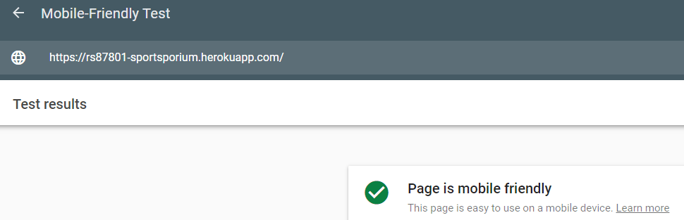
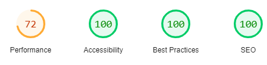
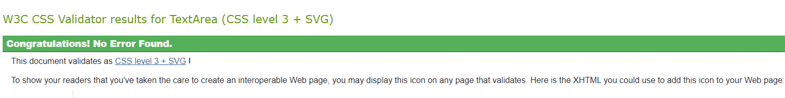
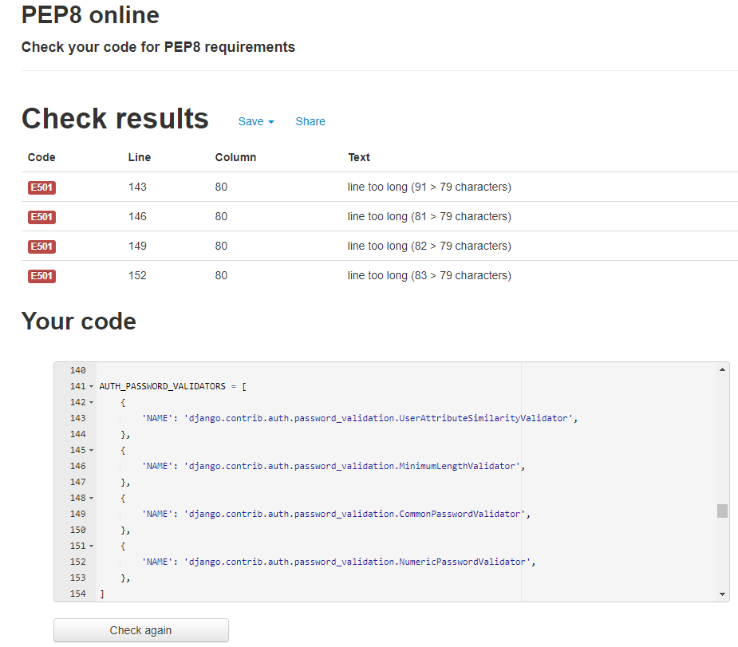

# [Sportsporium](https://rs87801-sportsporium.herokuapp.com/)

## Table of contents

-  [Testing](#testing)
    - [Testing User Stories](#testing-user-stories)
    - [Manual Testing](#manual-testing)
    - [Further Manual Testing](#further-manual-testing)
    - [Compatibility and Responsiveness](#compatibility-and-responsiveness)
    - [Validation](#validation)

***

## Demo
A live demo can be found - [here](https://rs87801-sportsporium.herokuapp.com/)

Main README.md file can be found - [here](https://github.com/Ranj247/sportsporium_v1/blob/main/README.md)

Project Repository can be found - [here](https://github.com/Ranj247/sportsporium_v1)

***

## Testing User Stories
---

### Viewing and navigation
1. As a new user I want to be able to immediately recognise website purpose so that I can identify the interest in the website content.
    - When a user visits the website, the hero image provides first glimpse on the website content and purpose.
    - The `Shop Now` button, on the middle of the website indicates what is the website's purpose.

2. As a new user I want to be able to navigate the site easily so that I can search for products effectively.
    - No matter what page the user lands on, they can easily find and use the navigation bar which also is set fixed, being available at all times.
    - The HOME link to the website is included in the dropdown-menu for the small to medium size screens, and for large screen logo always leads back to the home page.

3. As a new user I want to be able to view the website on mobile and other large devices so that I can use it on a desktop or on the go.
    - The website is responsive and tested on various devices as well as operating systems.
    - The footer is placed relative to the bottom of each page, so users will be able to see better website, especially on small devices.

4. As a general visitor I want to be able to get in touch website owner so that I can enquire about the products, and store policies.
 - Admin's email address has been provided in the Footer section for the user's potential queries.

5. As a new user & future shopper I want to be able to see product lists so that I can find which product I'd like to purchase.
 - The site contains links on the navigation bar with individual categories and sub-categories, where the user has the option to choose the product they are interested in.
 - There is a dropdown menu with sub-categories for ALL Products, Outfit, Shoes, Special Offers when a user is able to choose product they are interested in.

6. As a new user & future shopper I want to be able to check particular product's detail so that I can check product's price, description, rating, image and sizes before buying.
- Each product on the page, once clicked by the user on the picture, it redirects the user to the product's details page.

7. As a new user & future shopper I want to be able to identify sales, and special offers so that I can take advantage of special savings on products to purchase.
- The website has a SPECIAL OFFERS drop-down menu where the user can find Sales and New Arivals

8. As a new user & future shopper I want to be able to view the total of my purchases so that I can keep an eye on the purchase budget.
- A success message displays on the site every time a user adds a new product in the bag.
- The user can always click on the Shopping Bag which is on the right site of the navbar which shows updated total price for added products, and provides information on the delivery charges and further option to proceed to "Go to secure checkout" button.
- By clicking on the Shopping bag, the user is redirected to the shopping bag page where they can view the items, change quantity, remove from the bag or process to the secure checkup.

### Registration and User Accounts
9. As a new user & future shopper I want to be able to register for an account so that I can have a personal account and see my profile.
- From the navigation bar a new user is able to go to the "My Account" dropdown menu where the user can choose the Register button which redirects to the "Sign Up" page. 
- The Sign up form contains username, email address and password. The User needs to confirm email address and password.  
- When a user enters incorrect data, they are instructed to try again and if the form is completed correctly, the user is shown a success message and redirected to the page, where they are instructed to verify e-mail and a confirmation link is sent to the e-mail.

10. As a registered user I want to be able to login/out so that I can access my personal account information.
- From the navigation bar a new user is able to go to the "My Account" dropdown menu where the user can choose the Register button which redirects to the "Sign Up" page.
- By clicking on the "Sign in" page users can login to their account provided correct email or username and password are entered. A success message is displayed on the screen stating successful login into their account.
- Once a user is logged into their account, they have access to their My profile/Logout links from the "My Account " dropdown menu.

11. As a registered user I want to be able to reset the password in case I don't recall so that I can recover access to my account.
- On the "Sign in" page there is a link under "Sign In" button "Forgot password", which redirects the user to the "Password Reset" page. The user is asked to enter their email address and press the "Reset My Pasword" button. The User receives the recover password message in their email.

12. As a registered user I want to be able to receive an email confirmation upon registration so that I can verify account registration.
- Once a user is registered, they receives a confirmation email with a verification link in their account. 

13. As a registered user I want to be able to have a customized dashboard so that I can view order history, order confirmation, and save default information.
- On "My profile" page users can access, view and edit delivery information, order history and review history.

### Sorting and searching
14. As a Shopper I want to be able to sort the list of available products so that I can easily identify the best rated, best priced and categorically sorted products. 
- The searchbox on the navigation bar allows users to search products with keywords.
- The user can find a drop-down link under All Products category and select items based on the price, rating, and category.

15. As a Shopper I want to be able to sort a specific category of product so that I can find the best-priced or best-rated product in a specific category or sort the products in that category by name.
- On the navigation bar there is a drop-down list for categories Outfit and Footwear, which allows the user to select different sub-categories of products and sort chosen products on the search box depending on price or rate.

16. As a Shopper I want to be able to sort multiple categories of products simultaneously so that I can find the best-priced or best-rated products across broad categories, such as "outfit" or "footwear".
- On the navigation bar there is a drop-down list for categories Outfit and Footwear, which allows the user to select different sub-categories of products. And now, if the user selects All Outfit, the products page displays all sub-categories simultaneously and now the user can sort all sub-categories based on the search best-priced or best-rated.

17. As a Shopper I want to be able to search for a product by name or description so that I can find a specific product I'd like to purchase.
- There is a searchbox on the navigation bar where a user can search depending on the entered keyword.

18. As a Shopper I want to be able to easily see what I've searched for and the number of results so that I can quickly decide whether the product I want is available.
- Once the product is chosen it is displayed on the site with an image, name, price, category and rating and the number of results is displayed on the left site of the page.

### Purchasing the checkout
19. As a Shopper I want to be able to easily select the size and quantity of a product when purchasing it so that I can ensure I don't accidentally select the wrong product, quantity or size.
- Each product on the page, once clicked by the user on the picture, it redirects the user to the product's details page where they select the size and quantity of the item.

20. As a Shopper I want to be able to view items in my bag to be purchased so that I can decide if I want to purchase an item or edit it.
- Once the user clicks on the shopping bag he will be redirected to the "Shopping Bag" page where he is able to view/edit/delete/purchase the products in his bag.
- Users doesn't need to be logged in to view their bag or go to secure checkout.

21. As a Shopper I want to be able to adjust the quantity of individual items in my bag so that I can easily make changes to my purchase before checkout.
- On the Shopping bag page there are links "Update" and "Remove" which allow user to edit or delete product.
- On the detail product page each page contains the "ADD TO BAG" button.

22. As a Shopper I want to be able to easily enter my payment information so that I can checkout quickly and without hassles.
- Once the user chose the secure checkup button he will be redirected to the "Checkout page, where a user is able to use credit cards to purchase products.
- 'Allauth' provides a robust user account system while Stripe offers secure payments, furthered by use of webhooks to ensure transactions are recorded.

23. As a Shopper I want to be able to feel my personal and payment information is safe and secure so that I can confidently provide the needed information to make a purchase.
- The user's personal information is only available in their profile such as the name, address etc., but payment information is not stored on the account.
- 'Allauth' provides a robust user account system while Stripe offers secure payments, furthered by use of webhooks to ensure transactions are recorded.

24. As a Shopper I want to be able to view an order confirmation after checkout so that I can verify that I haven't made any mistakes.
- Once the user purchases a product, an order confirmation is displayed on the checkout page. 

25. As a Shopper I want to be able to receive an email confirmation after checking out so that I can keep the confirmation of what I've purchased for my records.
- Once the user purchases the product they ordered, the confirmation email is sent to the user email box. 

### Navigation
26. As a site owner I want to be able to access product management from the homepage so that I can access my account.
- On the navigation bar once the superuser/admin log in, they are provided access to the Product Management page.

27. As a site owner I want to be able to access my dashboard from the homepage so that I can return to my dashboard at any time.
- On the navigation bar there is an icon "My Account" with all the necessary links, which are visible after the administrator logs in.

28. As a site owner I want to be able to receive a notification when there is a pending order so that I can know when I am making money.
- Once the item is purchased, the confirmation email is sent to the user and the site owner.

### Product management
29. As a site owner I want to be able to add new products so that I can add new items to my online store.
- Once a site owner is logged in, they have access to the Product Management link from "My Account" dropdown menu. The admin will be redirected to the Product page to allow to add new product. 

30. As a site owner I want to be able to edit/update products so that I can update products prices, descriptions, images and other product criteria.
- Once a site owner is logged, they have access to the Edit button on each product placed on each product. The user will be redirected to the "Product management" page where they can update product details.
- The toast Alert message will display to inform Admin about editing the product.

31. As a site owner I want to be able to delete products so that I can remove erroneous products or products that are no longer available.
- Once a site owner is logged in, they have access to the "Delete" button on each product. They are redirected to the "Product management", page where they can remove the product from the database.

### Authentication & account
32. As a site owner I want to be able to verify my email address so that I can set up my account securely.
- The site owver is able to access the database by adding the "/admin" to the end of URL where they are able to verify their account , update email address  securely and manage the store from the backend.

33. As a site owner I want to be able to update my account information so that I can maintain access to my account.
- Once a site owner is logged in, they have access to the "My Profile" link from where they are able to edit and update the account information. 

34. As a site owner I want to be able to logout when I am finished with my work so that I can logout of my account. 
- On the "My account" dropdown menu where site user can Logout of his account. 

35. As a site owner I want to be able to reset my password so that I can recover my account or upgrade its security.
- On the "Sign in" page there is a link under "Sign In" button "Forgot password", which redirects the user to the "Password Reset" page. The user is asked to enter their email address and press the "Reset My Pasword" button. User will receive the recover password message in their email.

### Manual Testing
Manual testing was performed on the following elements that appear across all pages on the site, to ensure that all are working as expected;

#### All Pages

### Further Manual Testing
- Checked grammar and spelling throughout document.

- Ran README text through [Online-Spellcheck](https://www.online-spellcheck.com/) to double-check on grammar and spelling.

- Ran CSS through [Autoprefixer](https://autoprefixer.github.io/) and copied the resulted CSS codes back into style.css file.

- Test carried on the overall site colours on [a11y](https://color.a11y.com/), a Color Contrast Accessibility Validator.  

- Test carried on the Responsiveness of all pages using [Google Mobile-Friendly Test](https://search.google.com/test/mobile-friendly).  
          

- Test carried on grounds of Performance, Accessibility, Best Practices and SEO using [Lighthouse Report Viewer](https://googlechrome.github.io/lighthouse/viewer/).  
      
    [Result](https://googlechrome.github.io/lighthouse/viewer/?psiurl=https%3A%2F%2F8080-tan-hippopotamus-ptxfv8r3.ws-eu15.gitpod.io%2F&strategy=mobile&category=performance&category=accessibility&category=best-practices&category=seo&category=pwa&utm_source=lh-chrome-ext)  

### Compatibility and Responsiveness
The website has been tested on different browsers and electronic device, no compatibility issues noted. The site was found to be fully responsive on device sizes ranging from 320px X 480px to 1920px X 1080px.

- Browsers tested:
    - Chrome 
    - Safari 
    - Firefox 

- Devices tested:
    - iPhone 6
    - Samsung A20
    - Desktop PC
    - Laptop
    - Tablet
  

### Validation
#### HTML
- Tested [HTML Validation](https://validator.w3.org/) No errors or warnings to show. This validator does not recognise Jinja templates & scripting, so returns errors for the lines of code where Jinja is used - this is to be expected. No errors are present in the HTML code otherwise.

#### CSS
- Tested [CSS Validation](https://jigsaw.w3.org/css-validator/) No errors found.  
      

#### Javascript
- [JSHint](https://jshint.com/) was used to validate the JavaScript code in the script.js file. No errors are present.

#### Python
- [PEP8 Online](http://pep8online.com/) was used to validate the code in Python files.
- Expected errors were returned for the `settings.py` file:  
      
    - `line too long (>79 characters)` in the `AUTH_PASSWORD_VALIDATORS = [{}]` settings x4
    - This is a known issue with the built-in Django settings, and it would not be acceptable to force a line break in the dictionary value strings.
- All other Python code is fully PEP8 compliant.

***